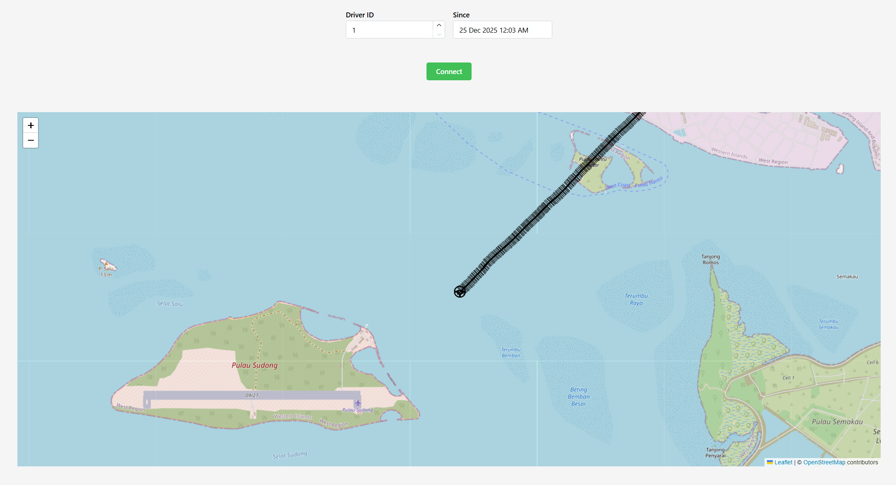
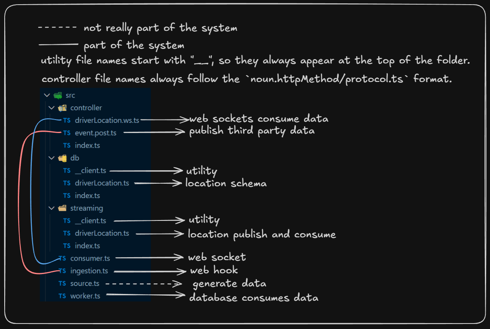
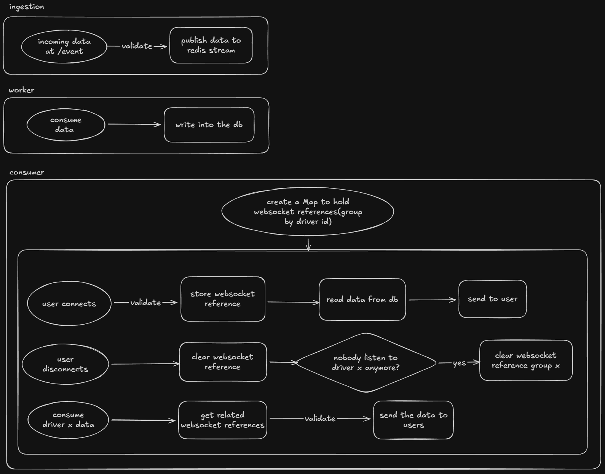

# Realtime Driver Tracking

## Note
This repository is outdated and does not reflect my latest design

## Setup

Note: I messed up a bit and run out of time to fix it, here we use bun instead of nodejs

### First Step

install bun https://bun.com/

window

```sh
powershell -c "irm bun.sh/install.ps1 | iex"
```

Linux / MacOS  

```sh  
curl -fsSL https://bun.sh/install | bash
```
  
### Second Step

install the dependencies for both servers and frontend

```sh
npm run setup
```

Optional: install biomejs extension for code formatting https://marketplace.visualstudio.com/items?itemName=biomejs.biome

### Third Step

create a `.env` file in the root directory with the following content

```env
DATABASE_URL=
REDIS_URL=
```

### Fourth Step

setup a neon psql database https://neon.tech/


get the connection string and put it in the `.env` file as `DATABASE_URL`

then run the following command to create the database schema and apply migrations

```sh
npx drizzle-kit generate
npx drizzle-kit migrate
```


### Fifth Step

setup a upstash redis https://upstash.com/


Select your database, then


get the connection string and put it in the `.env` file as `REDIS_URL`

finally you should have something like this in your `.env` file


## Run

### Servers

to run 2 servers(ingestion and consumer), 1 process (worker) and one frontend

```sh
npm run dev
```

### UI

to view the frontend open http://localhost:5173

select a driver and pick a date time then click `connect`



### Generate Data

I am not sure why but I can't get continuous data from the original source, so I generate the data myself

open a new terminal and run

```sh
npm run source
```

## Power Point Presentation

https://1drv.ms/p/c/51b9de335e9a5f2e/IQAlsqsWA_2-QLYljlmgBqRTAdZJqY5weowPgedLp4xYUv4?e=wsBnhN

## Video Demo

[](https://youtu.be/5Nr1P-aNtG8)

## Folder Structure



## Code Flowchart


